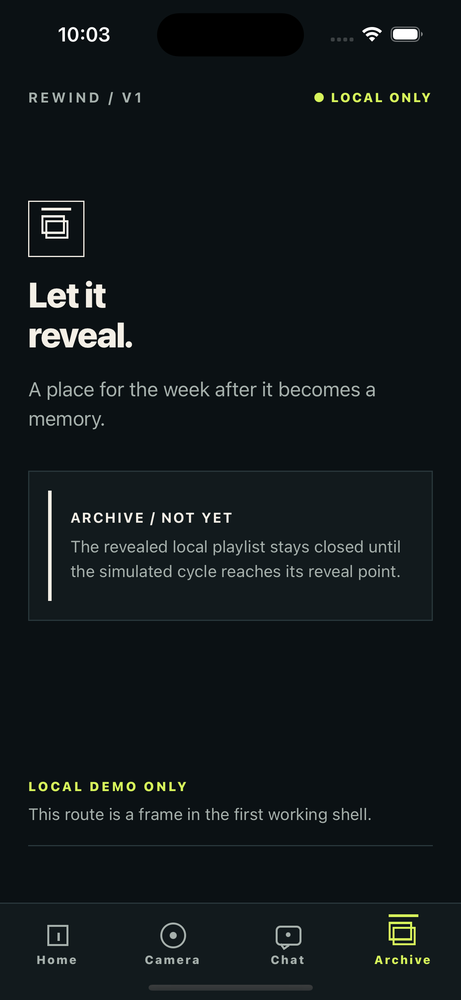

# Issue 13 completion evidence

- Issue: [#13 — Establish testing, accessibility, and evidence selector contract](https://github.com/Collaboration95/rewind-v1/issues/13)
- Branch: `codex/13-testing-accessibility-evidence`
- Implementation commit: [e3078f6](https://github.com/Collaboration95/rewind-v1/commit/e3078f61cb42dd104e723c20a4b33a8208710077)

## Scope delivered

The mobile workspace now has an Expo SDK 57-compatible Jest configuration,
React Native Testing Library setup, and a rendered Home-route smoke test. The
existing dependency-free Node contract lane remains in place; `npm run test`
executes both lanes once without watch mode. The mobile README documents the
stable `testID` and accessibility-label contract, and the evidence README
defines completion metadata, synthetic-only artifacts, and the local-first
privacy boundary.

## Verification

- `make check` — PASS (workflow parser, format check, lint, typecheck, six Node contract tests, and one Jest/RNTL smoke test).
- `npm run test -- --runInBand` from `apps/mobile/` — PASS (six Node contract tests and one Jest/RNTL smoke test).
- `npm run build:web` from `apps/mobile/` — PASS (Expo web export).
- `git diff --check` — PASS.
- `xcrun simctl io E04733A2-E8FD-4C1D-81B5-5E7F927E2637 screenshot evidence/issues/13/archive-route-shell.png` — PASS on the booted iPhone 15 Pro, iOS 17.5 simulator; the capture contains only synthetic route-shell content.

Relevant test output:

```text
ℹ tests 6
ℹ pass 6
ℹ fail 0
PASS tests/home-screen.test.tsx
Tests: 1 passed, 1 total
```

The rendered test proves the Home route's semantic header role, local-only
accessibility label, and stable route/title `testID`s. The simulator capture is
visual context only; it is not a claim of physical-device capability or direct
accessibility-tree inspection.

## Evidence



- [Synthetic simulator route-shell capture](./archive-route-shell.png)

## Limitations

No physical-device or native capability verification was required by this
testing-contract ticket. Camera, microphone, notifications, haptics, and other
native flows remain the responsibility of their later tickets and must use
synthetic evidence unless a supported device is available.
