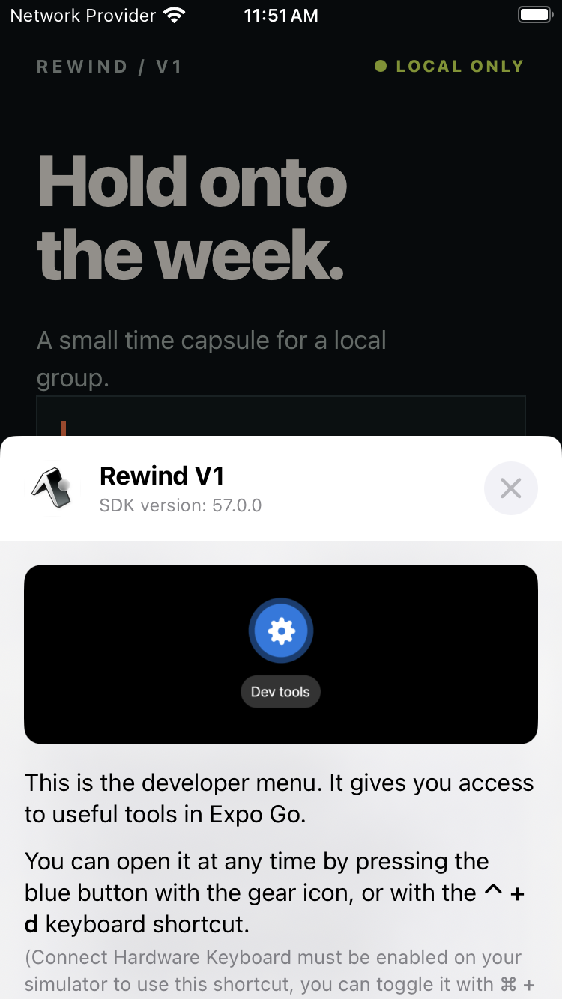

# Issue #18 completion evidence

- Issue: https://github.com/Collaboration95/rewind-v1/issues/18
- Implementation commit: `cc47d78` (`feat(session): add local profile switching and membership guard`)
- Verification date: 2026-08-30 (Asia/Singapore)

## Automated verification

All commands were run from `apps/mobile/`:

| Command | Result |
| --- | --- |
| `npm run format:check` | PASS |
| `npm run lint` | PASS |
| `npm run typecheck` | PASS (mobile and domain) |
| `npm run test` | PASS (22 Node contract tests, 3 Jest component tests) |
| `npm run build:web` | PASS (Expo web export, including the SQLite WASM asset) |

The session domain tests cover all five seeded profiles and a non-member
rejection with no group mutation. The real SQLite test covers the seeded
`local_session` row, selection persistence across a repository relaunch, and
reset back to the default synthetic actor. The rendered component tests cover
the five labelled controls, current-actor state, selection persistence, and
the safe rejection state.

## Device verification

The iOS 17.5 iPhone SE (3rd generation) simulator was booted and the Expo Go
bundle loaded the Rewind screen. Expo Go displayed its developer-menu
onboarding sheet over the app before the selector could be reached:

The available Computer Use accessibility channel repeatedly returned
`-10005: timeoutReached` for the Simulator window, so the sheet could not be
dismissed and a profile could not be tapped honestly. No device selection is
claimed as verified. The screenshot is retained to make the limitation
reproducible; the automated component and SQLite evidence remain available.
