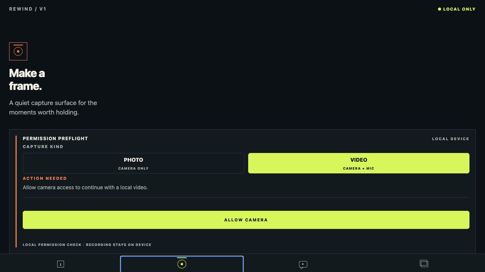
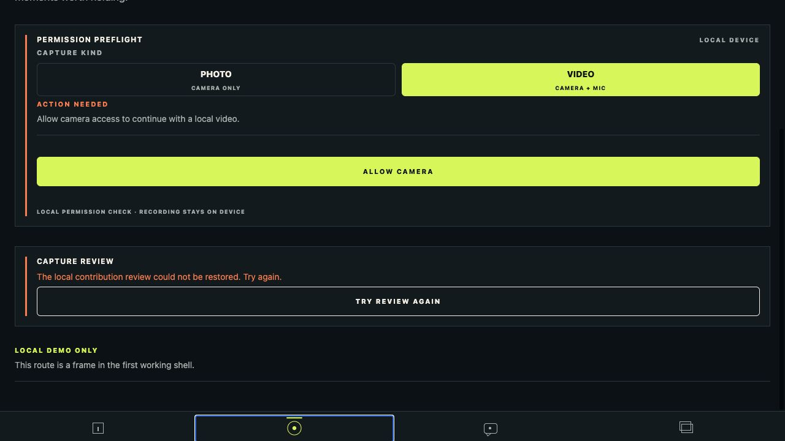

# Issue #23 completion evidence

- Issue: [#23 — Review, submit, process-simulate, and lock a contribution](https://github.com/Collaboration95/rewind-v1/issues/23)
- Branch: `codex/23-review-lock`
- Implementation commit: `5898225` (`feat(capture): add local contribution review lock flow`)
- Scope: local-only photo/video review, discard, submission validation, deterministic processing, lock persistence, and pre-reveal safe metadata

## Acceptance coverage

- Review exposes media kind, duration, selected vignette, and a local-file status without rendering a URI, image, thumbnail, or player. Photo and video use the same review surface.
- Submission re-checks active membership, cycle state, media duration, vignette, local-file presence, and the current per-member quota before processing. Over-budget and missing-file outcomes remain captured and display a safe rejection reason.
- Accepted submission persists the policy transitions `captured → processing → locked`, appends auditable validation/start/completion events, and shows the Processing state before the locked state.
- Locked review is metadata-only and displays that the contribution is held until reveal. Discard removes the captured local file and metadata before submission.
- The real SQLite close/reopen test restores the locked contribution with `processingAttempt: 1`; the same persisted records calculate the updated quota after relaunch.

## Verification

All commands were run from the repository root unless noted.

| Command | Result |
| --- | --- |
| `make check` | PASS — workflow YAML, formatting, lint, TypeScript, 30 contract/domain tests, 34 Jest tests |
| `npm run build:web` from `apps/mobile` | PASS — Expo web export completed with 912 modules |
| `python /Users/speedpowermac/.codex/plugins/cache/openai-curated-remote/frontend-design-premium/1.4.0/skills/frontend-design-premium/scripts/audit_project.py . --mode strict --no-write` | PASS — zero findings, warnings, or violations |
| `npm run build:ios` from `apps/mobile` | BLOCKED by host — `xcodebuild` exit 70 because destination `5F659D47-CF47-4296-A1AC-B41CFF0830C5` requires the unavailable iOS 26.5 platform |

The component tests use synthetic photo/video review records and cover submit,
Processing, Locked, safe rejection, discard, and no-locator rendering. The
SQLite test uses Node's real SQLite driver, inserts a synthetic captured video,
submits it, closes the database, reopens the same file, and verifies locked
state plus quota.

## Device and environment limitation

The static web export renders the camera route and its actionable review restore
state, but this host cannot initialize Expo SQLite in the static browser
environment. The native iOS build is also blocked by the missing iOS 26.5
platform, and the locked simulator host remains unable to complete manual Expo
Go navigation because its onboarding sheet is present. No physical recording,
relaunch, or native locked-screen success is claimed here. No personal media or
identifiers are included; screenshots contain only synthetic UI copy.

## Screenshots

