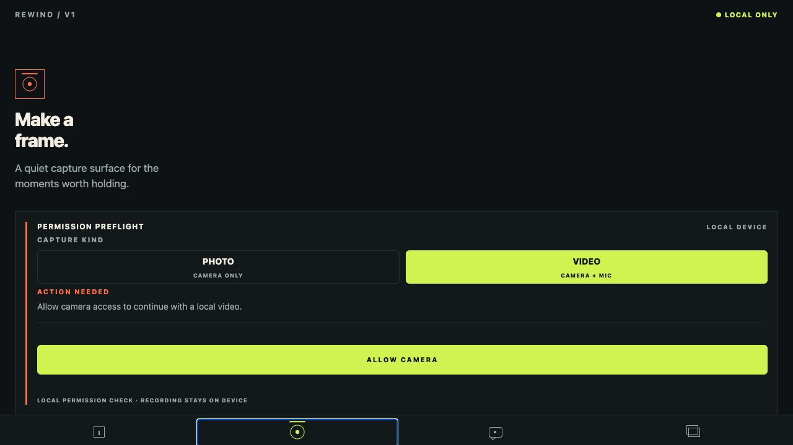
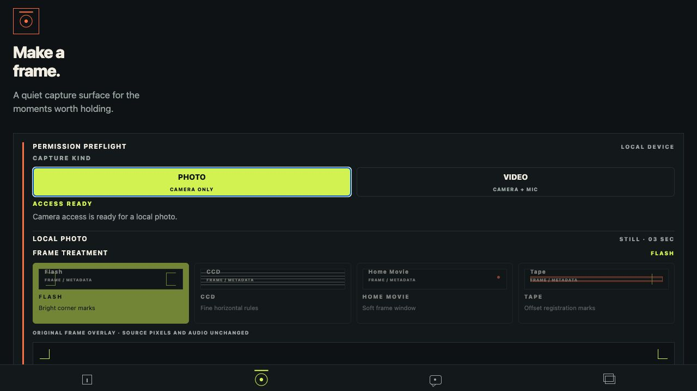

# Issue #24 completion evidence

- Issue: [#24 — Implement original preset overlays and capture haptic feedback](https://github.com/Collaboration95/rewind-v1/issues/24)
- Branch: `codex/24-original-vignettes`
- Implementation commit: `bfb5699` (`feat(capture): add original vignette and haptic cues`)
- Scope: original presentation-only photo/video treatments, persisted vignette metadata, and safe local haptic cues
- Evidence uses synthetic UI/content only; no personal media or private identifiers are included.

## Acceptance coverage

- The shared capture surface exposes the canonical `Flash`, `CCD`, `Home Movie`, and `Tape` labels with original View-based frame/preview overlays. The picker has stable test IDs, selected accessibility state, action descriptions, and a source-pixels/audio disclosure.
- The selected `vignetteTreatment` travels through both photo and video capture save inputs and is shown again in the existing metadata-only review card. Component tests exercise all four selection states and verify `ccd` and `tape` persistence paths.
- Record, stop, and lock-ready cues use the `HapticsPort`; the Expo adapter maps them to impact/notification feedback and catches unavailable-device failures. Dependency loading treats haptics as optional, so a missing adapter cannot block local capture or locking.
- Copy and UI do not claim that pixels or audio were filtered, transcoded, or otherwise altered. No copied assets, network calls, image/video processing, or media previews were added.

## Verification

All commands were run from the repository root unless noted.

| Check | Result |
| --- | --- |
| `make check` | PASS — workflow YAML, formatting, lint, TypeScript, 32 contract/domain checks, and 35 Jest tests |
| `npm run build:web` from `apps/mobile` | PASS — Expo web export completed successfully |
| `python /Users/speedpowermac/.codex/plugins/cache/openai-curated-remote/frontend-design-premium/1.4.0/skills/frontend-design-premium/scripts/audit_project.py . --mode strict --no-write` | PASS — zero findings, warnings, or violations |
| `npm run build:ios` from `apps/mobile` | BLOCKED by host toolchain — `xcodebuild` exit 70 because destination `5F659D47-CF47-4296-A1AC-B41CFF0830C5` requires the unavailable iOS 26.5 platform |

The component lane uses injected camera, local-store, and haptic ports; it
verifies accessibility, treatment selection, metadata handoff, record/stop
cues, lock-ready feedback, safe rejection, discard, and URI-free UI. The
contract lane verifies that native haptics remain behind the adapter and that
presentation treatments do not mount image/video processing or network APIs.

## Device and browser limitation

The browser flow reached `ACCESS READY` for a synthetic still-camera
permission state and rendered the four treatment cards plus the selected
frame overlay. Its local camera/storage dependency then reported an actionable
preparation failure; no physical capture, local-file copy, or haptic success is
claimed from the browser. The native iOS build remains blocked until Xcode's
iOS 26.5 platform is installed or a supported physical device is available.

## Screenshots

