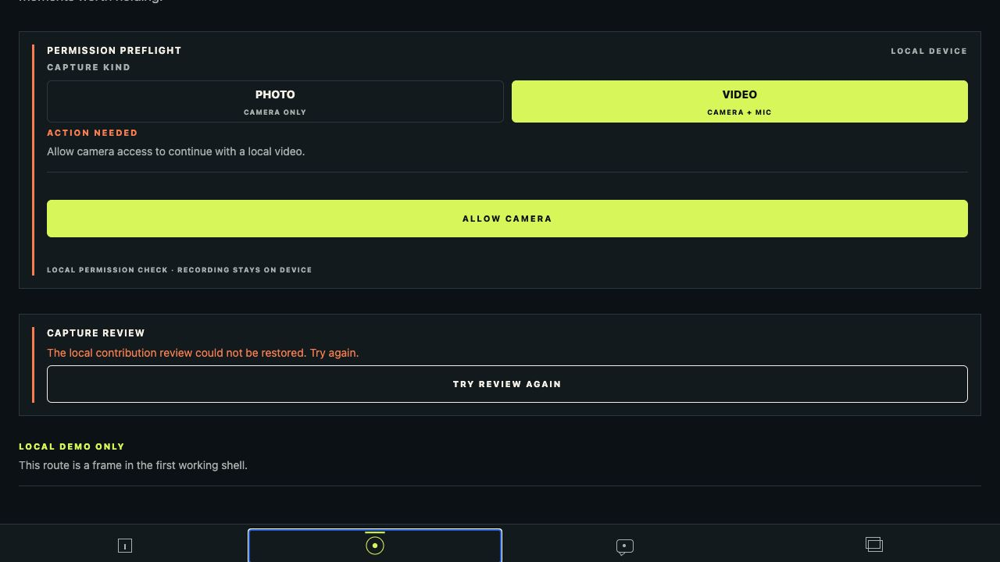

# Issue #25 completion evidence

- Issue: [#25 — Handle deletion, failure, retry, and lock-safe UI paths](https://github.com/Collaboration95/rewind-v1/issues/25)
- Branch: `codex/25-deletion-failure-retry`
- Scope: local pre-reveal deletion, one bounded processing retry, and safe review recovery UI
- Evidence uses synthetic state only. No personal media, local URI, thumbnail, image, or video is included.

## Acceptance coverage

- The review store now sends deletion through the domain policy with a simulated ISO-week key and the persisted audit history. On the first accepted deletion it removes the app-managed file, persists `state: deleted` with `localUri: null`, writes the audit record, and restores the contribution quota. A storage-removal error leaves the contribution and quota unchanged.
- A second deletion in the same simulated week is rejected by policy before any file removal or contribution write. The review remains visible and receives the policy reason.
- Processing can be deterministically failed through an injected `ProcessingSimulationPort`. The panel exposes a retry action only while the bounded retry remains available. The retry returns through `processing` and either locks or safely reports the final delayed state; the store always updates the same contribution record rather than creating another.
- Delete is available only for captured, failed, or locked pre-reveal contributions and requires an inline app-owned confirmation. The review never renders a media URI, image, thumbnail, or player before reveal.
- All new interactions have stable test IDs and descriptive button/alert semantics: `review-delete`, `review-delete-confirmation`, `review-delete-confirm`, `review-delete-cancel`, `review-processing-delayed`, and `review-retry-processing`.

## Verification

All commands ran from the repository root unless otherwise stated.

| Check | Result |
| --- | --- |
| `make typecheck` | PASS — mobile and domain TypeScript checks completed without errors |
| `npm --prefix apps/mobile test -- --runInBand tests/local-contribution-review-store.test.ts tests/contribution-review.test.tsx` | PASS — store and component tests cover first delete/quota restore, second refusal, file-removal failure, fail/retry/lock, confirmation, and locator-free UI |
| `make check` | PASS — workflow YAML, formatting, lint, TypeScript, contract/domain checks, and Jest suite all passed |
| `make build-web` | PASS — Expo exported the web bundle to ignored `apps/mobile/dist` |
| `python /Users/speedpowermac/.codex/plugins/cache/openai-curated-remote/frontend-design-premium/1.4.0/skills/frontend-design-premium/scripts/audit_project.py . --mode strict --no-write` | PASS — zero findings, warnings, or violations |

## Browser and native limitations

The exported browser build renders the Camera route and its accessible recovery state, but its local SQLite-backed contribution review could not be restored in this browser environment. The screenshot records that truthful action-needed state; it does not claim a browser-based delete or retry success. Those state transitions are proven by deterministic component/store tests using the same local repository and file ports.

The existing native iOS host limitation remains: the configured simulator destination `5F659D47-CF47-4296-A1AC-B41CFF0830C5` requires the unavailable iOS 26.5 platform, causing `xcodebuild` exit 70. No physical-device media or haptic success is claimed.

## Screenshot

